# Schema

This document summarizes the current state machines for core components, routes, and controllers.
It is derived from `routes/*.php` and the controller list under `app/Http/Controllers`.

## Global access flow

## Users component

## Institutions: nations, academies, schools, clans

## Events and event types

## Fees, orders, and shop flows

## Imports and exports

## Announcements and roles

## Weapon forms

## Public website routing

## Role-scoped route packs

The controllers are shared; the role groups define access and route names. Below are the role-specific state machines.

### Technician routes

### Athlete routes

### Instructor routes

### Dean routes

### Manager routes

```mermaid
stateDiagram-v2
  [*] --> ManagerFees
  ManagerFees: GET /manager/fees (FeeController@index)
  ManagerFees --> ManagerFeesEstimate: GET /manager/fees/extimate (FeeController@extimateFeeConsumption)
  ManagerFees --> ManagerFeesAssociate: POST /manager/fees/associate (FeeController@associateFeesToUsers)

  [*] --> ManagerUsers
  ManagerUsers: GET /manager/users (PaginatedUserController@index)
  ManagerUsers --> ManagerUsersFiltered: GET /manager/filtered-by-dashboard (PaginatedUserController@usersFilteredByActiveAndCoursePagination)
  ManagerUsers --> ManagerUserFilter: GET /manager/users/filter (UserController@filter)
  ManagerUsers --> ManagerUserFilterResult: GET /manager/users/filter/result (UserController@filterResult)
  ManagerUsers --> ManagerUserSearch: GET /manager/users/search (UserController@search)
  ManagerUsers --> ManagerUserCreate: GET /manager/users/create (UserController@create)
  ManagerUserCreate --> ManagerUserStored: POST /manager/users (UserController@store)
  ManagerUsers --> ManagerUserEdit: GET /manager/users/{user} (UserController@edit)
  ManagerUserEdit --> ManagerUserUpdated: POST /manager/users/{user} (UserController@update)
  ManagerUserEdit --> ManagerUserDisabled: DELETE /manager/users/{user} (UserController@destroy)
  ManagerUserEdit --> ManagerUserRolesUpdated: POST /manager/user-roles/{user} (UserController@updateRoles)
  ManagerUserEdit --> ManagerUserPictureUpdated: PUT /manager/users/{user}/picture (UserController@picture)
  ManagerUserEdit --> ManagerWeaponFormsAthlete: POST /manager/users/{user}/weapon-forms-athlete (UserController@editWeaponFormsAthlete)
  ManagerUserEdit --> ManagerWeaponFormsDate: POST /manager/users/{user}/weapon-forms-edit-date (UserController@editWeaponFormsAwardingDate)
  ManagerUsers --> ManagerAssociateSchool: POST /manager/users/associate-school (UserController@associateSchool)
  ManagerUsers --> ManagerRemoveSchool: POST /manager/users/remove-school (UserController@removeSchool)
  ManagerUsers --> ManagerSetMainInstitution: POST /manager/users/set-main-institution (UserController@setMainInstitution)

  [*] --> ManagerRoles
  ManagerRoles: GET /manager/custom-roles (RoleController@index)
  ManagerRoles --> ManagerRolesSearch: GET /manager/custom-roles/search (RoleController@search)
  ManagerRoles --> ManagerRolesAssign: POST /manager/custom-roles/assign (RoleController@assign)
  ManagerRoles --> ManagerRolesStored: POST /manager/custom-roles (RoleController@store)

  [*] --> ManagerAcademies
  ManagerAcademies: GET /manager/academy (AcademyController@index)
  ManagerAcademies --> ManagerAcademiesAll: GET /manager/academies/all (AcademyController@all)
  ManagerAcademies --> ManagerAcademiesSearch: GET /manager/academies/search (AcademyController@search)
  ManagerAcademies --> ManagerAcademyEdit: GET /manager/academies/{academy} (AcademyController@edit)
  ManagerAcademyEdit --> ManagerAcademyUsersCreated: POST /manager/academies/{academy}/users/create (UserController@storeForAcademy)
  ManagerAcademyEdit --> ManagerAcademyPersonnelAdded: POST /manager/academies/{academy}/add-personnel (AcademyController@addPersonnel)
  ManagerAcademyEdit --> ManagerAcademyPersonnelRemoved: POST /manager/academies/{academy}/remove-personnel (AcademyController@removePersonnel)
  ManagerAcademyEdit --> ManagerAcademyAthleteAdded: POST /manager/academies/{academy}/add-athlete (AcademyController@addAthlete)
  ManagerAcademyEdit --> ManagerAcademyAthleteRemoved: POST /manager/academies/{academy}/remove-athlete (AcademyController@removeAthlete)
  ManagerAcademies --> ManagerAcademyUsersSearch: GET /manager/academies/{academy}/users-search (AcademyController@searchUsers)

  [*] --> ManagerSchools
  ManagerSchools: GET /manager/school (SchoolController@index)
  ManagerSchools --> ManagerSchoolsAll: GET /manager/schools/all (SchoolController@all)
  ManagerSchools --> ManagerSchoolsByAcademy: GET /manager/schools/academy (SchoolController@getByAcademy)
  ManagerSchools --> ManagerSchoolsIndex: GET /manager/schools (SchoolController@index)
  ManagerSchools --> ManagerSchoolsSearch: GET /manager/schools/search (SchoolController@search)
  ManagerSchools --> ManagerSchoolEdit: GET /manager/schools/{school} (SchoolController@edit)
  ManagerSchoolEdit --> ManagerSchoolUpdated: POST /manager/schools/{school} (SchoolController@update)
  ManagerSchoolEdit --> ManagerSchoolUsersCreated: POST /manager/schools/{school}/users/create (UserController@storeForSchool)
  ManagerSchoolEdit --> ManagerSchoolClanCreated: POST /manager/schools/{school}/clan/create (ClanController@storeForSchool)
  ManagerSchoolEdit --> ManagerSchoolClanAdded: POST /manager/schools/{school}/clans (SchoolController@addClan)
  ManagerSchoolEdit --> ManagerSchoolPersonnelAdded: POST /manager/schools/{school}/add-personnel (SchoolController@addPersonnel)
  ManagerSchoolEdit --> ManagerSchoolPersonnelRemoved: POST /manager/schools/{school}/remove-personnel (SchoolController@removePersonnel)
  ManagerSchoolEdit --> ManagerSchoolAthleteAdded: POST /manager/schools/{school}/athlete (SchoolController@addAthlete)
  ManagerSchoolEdit --> ManagerSchoolAthleteRemoved: POST /manager/schools/{school}/remove-athlete (SchoolController@removeAthlete)

  [*] --> ManagerClans
  ManagerClans: GET /manager/courses (ClanController@index)
  ManagerClans --> ManagerClansSchool: GET /manager/courses/school (ClanController@getBySchool)
  ManagerClans --> ManagerClansAll: GET /manager/courses/all (ClanController@all)
  ManagerClans --> ManagerClansSearch: GET /manager/courses/search (ClanController@search)
  ManagerClans --> ManagerClanCreate: GET /manager/courses/create (ClanController@create)
  ManagerClanCreate --> ManagerClanStored: POST /manager/courses (ClanController@store)
  ManagerClans --> ManagerClanEdit: GET /manager/courses/{clan} (ClanController@edit)
  ManagerClanEdit --> ManagerClanUpdated: POST /manager/courses/{clan} (ClanController@update)
  ManagerClanEdit --> ManagerClanDisabled: DELETE /manager/courses/{clan} (ClanController@destroy)
  ManagerClanEdit --> ManagerClanUserCreated: POST /manager/courses/{clan}/user/create (UserController@storeForClan)
  ManagerClanEdit --> ManagerClanInstructorAdded: POST /manager/courses/{clan}/add-instructors (ClanController@addInstructor)
  ManagerClanEdit --> ManagerClanInstructorRemoved: POST /manager/courses/{clan}/remove-instructors (ClanController@removeInstructor)
  ManagerClanEdit --> ManagerClanAthleteAdded: POST /manager/courses/{clan}/add-athlete (ClanController@addAthlete)
  ManagerClanEdit --> ManagerClanAthleteRemoved: POST /manager/courses/{clan}/remove-athlete (ClanController@removeAthlete)

  [*] --> ManagerEvents
  ManagerEvents: GET /manager/events (EventController@index)
  ManagerEvents --> ManagerEventsAll: GET /manager/events/all (EventController@all)
  ManagerEvents --> ManagerEventsSearch: GET /manager/events/search (EventController@search)
  ManagerEvents --> ManagerEventsCalendar: GET /manager/events/calendar (EventController@calendar)
  ManagerEvents --> ManagerEventCreate: GET /manager/events/create (EventController@create)
  ManagerEventCreate --> ManagerEventStored: POST /manager/events (EventController@store)
  ManagerEvents --> ManagerEventEdit: GET /manager/events/{event} (EventController@edit)
  ManagerEventEdit --> ManagerEventUpdated: POST /manager/events/{event} (EventController@update)
  ManagerEventEdit --> ManagerEventDescriptionSaved: POST /manager/events/{event}/description (EventController@saveDescription)
  ManagerEventEdit --> ManagerEventLocationSaved: POST /manager/events/{event}/location (EventController@saveLocation)
  ManagerEventEdit --> ManagerEventThumbnailUpdated: PUT /manager/events/{event}/thumbnail (EventController@updateThumbnail)
  ManagerEventEdit --> ManagerEventParticipants: GET /manager/events/{event}/participants (EventController@participants)
  ManagerEventEdit --> ManagerEventAvailable: GET /manager/events/{event}/available-users (EventController@available)
  ManagerEventEdit --> ManagerEventParticipantsAdd: POST /manager/add-participants (EventController@selectParticipants)
  ManagerEventEdit --> ManagerEventParticipantsExport: GET /manager/events/{event}/participants/export (EventController@exportParticipants)
  ManagerEvents --> ManagerEventTypes: GET /manager/event-types/json (EventTypeController@list)
  ManagerEventEdit --> ManagerEventAvailablePersonnel: GET /manager/events/{event}/available-personnel (EventController@availablePersonnel)
  ManagerEventEdit --> ManagerEventPersonnel: GET /manager/events/{event}/personnel (EventController@personnel)
  ManagerEventEdit --> ManagerEventPersonnelAdded: POST /manager/events/{event}/add-personnel (EventController@addPersonnel)

  [*] --> ManagerImports
  ManagerImports: GET /manager/imports (ImportController@index)
  ManagerImports --> ManagerImportCreate: GET /manager/imports/create (ImportController@create)
  ManagerImportCreate --> ManagerImportStored: POST /manager/imports (ImportController@store)
  ManagerImports --> ManagerImportUpdated: POST /manager/imports/{import} (ImportController@update)
  ManagerImports --> ManagerImportDownload: GET /manager/imports/{import}/download (ImportController@download)
  ManagerImports --> ManagerImportTemplate: GET /manager/imports/template (ImportController@template)

  [*] --> ManagerExports
  ManagerExports: GET /manager/exports (ExportController@index)
  ManagerExports --> ManagerExportCreate: GET /manager/exports/create (ExportController@create)
  ManagerExportCreate --> ManagerExportStored: POST /manager/exports (ExportController@store)
  ManagerExports --> ManagerExportUpdated: POST /manager/exports/{export} (ExportController@update)
  ManagerExports --> ManagerExportDownload: GET /manager/exports/{export}/download (ExportController@download)

  [*] --> ManagerAnnouncements
  ManagerAnnouncements: GET /manager/announcements (AnnouncementController@ownRoles)
  ManagerAnnouncements --> ManagerAnnouncementSeen: POST /manager/announcements/{announcement}/seen (AnnouncementController@setSeen)
```

### Rector routes

